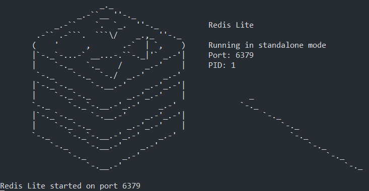

# RedisLite - A Simple Redis Clone

`RedisLite` is a basic implementation of simple, lightweight in-memory key-value store built in `Java`, inspired by Redis. The purpose of this project is to understand how Redis works and how basic commands are implemented. It currently supports a subset of Redis commands and is designed for learning purposes.

It is intended for learning purposes and does **not** aim to replicate Redis's full feature set or performance capabilities.

## Features

### Basic Commands:

- **SET key value**: Store a value with the given key.
- **GET key**: Retrieve the value associated with the given key.

### Additional Commands:

- **DEL key**: Delete a key from the store.
- **EXISTS key**: Check if a key exists.
- **INCR key**: Increment the value of a key by 1 if it's an integer.
- **INCRBY key increment**: Increment the value of a key by a given integer.
- **FLUSHALL**: Clear the entire store.

- Uses Redis CLI for communication.
- RESP (Redis Serialization Protocol) parser for command handling.
- Built with pure Java for learning purpose.

#

## Compile and Run:

- Compile the Project : `javac -d out -sourcepath ./src/main/java ./src/main/java/com/redislite/Redis.java`
- Get it running : `java -cp out com.redislite.Redis`

